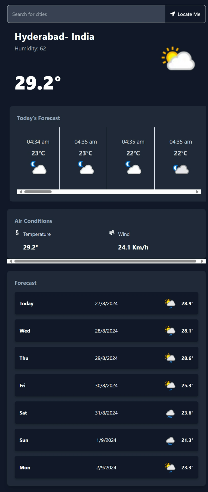

# Weather App 🌤

## Project Overview

A simple weather app built with React.js and Tailwind CSS that fetches weather data using a public weather API. Users can search for current weather conditions by entering a city name or by using location coordinates from their device.

## Instructions to Set Up and Run the Project Locally

Follow these steps to set up the project on your local machine:

1. *Clone the repository:*

bash
git clone https://github.com/adityarompella/weather-web-reactjs.git

2. *Navigate to the project directory:*

bash
cd weather-web-reactjs

3. *Install dependencies:*

Ensure you have Node.js installed. Then, run the following command to install all required dependencies:

bash
npm install

4. **Create an .env file:**

In the root of the project, create an .env file and add your Weather API key like this:

bash
VITE_WEATHER_API_KEY="686a81e1abd14e5ea6f174721242608"

You can obtain your API key by signing up at [WeatherAPI](https://www.weatherapi.com/).

5. *Run the development server:*

Once everything is set up, start the app using the following command:

bash
npm run dev

## API Usage Details

- *API Provider*: [WeatherAPI](https://www.weatherapi.com/)  
  The app uses WeatherAPI to fetch current weather data and a 7-day forecast.

### Endpoints and Examples

1. *Current Weather* (/v1/current.json)
   - Retrieves current weather by city name or coordinates.
   - *Parameters*:  
     - key: Your API key  
     - q: Location (city name or coordinates)  
     - aqi: Air quality index (set to "no")
   - *Example Request*:
     bash
     GET https://api.weatherapi.com/v1/current.json?key=YOUR_API_KEY&q=London&aqi=no
     

2. *7-Day Forecast* (/v1/forecast.json)
   - Fetches a 7-day weather forecast by city name or coordinates.
   - *Parameters*:  
     - key: Your API key  
     - q: Location (city name or coordinates)  
     - days: Number of days (set to 7)  
     - aqi: Air quality index (set to "no")  
     - alerts: Weather alerts (set to "no")
   - *Example Request*:
     bash
     GET https://api.weatherapi.com/v1/forecast.json?key=YOUR_API_KEY&q=New+York&days=7&aqi=no&alerts=no
     

## Screenshots

### Desktop View

### Mobile View

## Tech Stack

- *React.js*: The core framework used to build the app.
- *Axios*: For making HTTP requests to the weather API.
- *Tailwind CSS*: Used for styling the app and ensuring responsive design.

### Approach

This app uses Axios to handle API calls. The application state is managed using the Context API, which keeps track of the current weather data fetched either by city name or geographic coordinates (latitude and longitude). The app also manages the loading and error states to indicate the success or failure of data fetching. Additionally, search history is stored in the local storage to keep track of previously searched cities.

## Features

- 🌦 *View Current Weather:* Displays current weather information like temperature, weather condition, and more.
- 🏙 *Search by City Name:* Allows users to search for weather information by entering a city name.
- 📍 *Locate Me:* Fetches and displays the weather based on the user's current geographic location.
- 🕒 *Search History:* Saves previously searched cities in the local storage for quick access later (no duplicates).
- 📱 *Responsive Design:* The app is fully responsive, optimized for both desktop and mobile screens.
- 🌐 *Deployed App:* The application is deployed on [Render Web Hosting](https://weather-web-reactjs.onrender.com/). Click here for the live preview.
